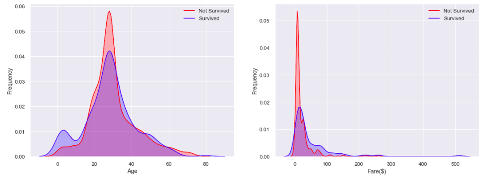
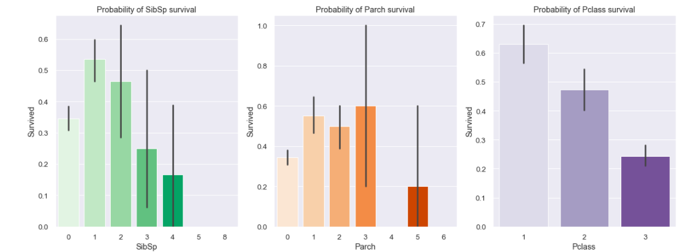
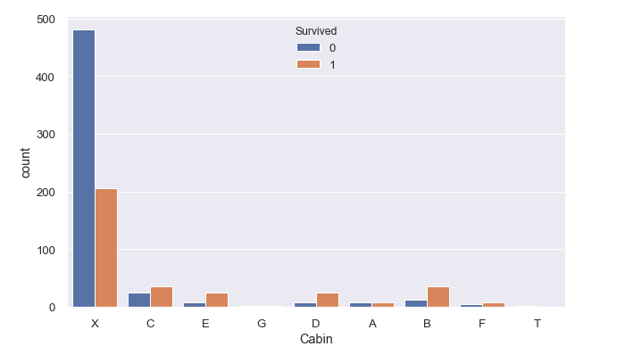
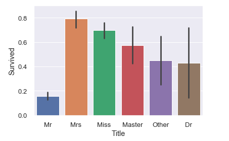

## Predict Titanic survival using XGBoost
On April 15, 1912, during her maiden voyage, the widely considered “unsinkable” RMS Titanic sank after colliding with an iceberg. 
Unfortunately, there weren’t enough lifeboats for everyone onboard, resulting in the death of 1502 out of 2224 passengers and crew.

While there was some element of luck involved in surviving, it seems some groups of people were more likely to survive than others.

The goal of this project is to use machine learning to create a model that predicts which passengers survived the Titanic shipwreck. 
The machine learning algorithm that we will particularly try in this project is XGBoost.

### About XGBoost
XGBoost stands for eXtreme Gradient Boosting. It is an implementation of gradient boosted decision trees designed for speed and performance.
The two reasons to use XGBoost are also the two goals of the project:
* Execution Speed: generally, XGBoost is fast. Really fast when compared to other implementations of gradient boosting.
* Model Performance: XGBoost dominates structured or tabular datasets on classification and regression predictive modeling problems.

### About the dataset
The dataset includes 1,309 records separated into train set and test set. Some of the features included in the Titanic dataset are Survival, 
Pclass, Sex, Age, Ticket, Cabin, etc.

### Findings
Below are some of the findings on the Titanic dataset:

The 2 charts above shows the relationship between Age and survival rate and between Fare $ amount and survival rate. 
* For the first chart, there's a peak of survival 
for age between 0 and 3, which makes sense as small children were prioritized first when the ship got wrecked. Adults around in their 30s died the most,  
but also survied more than any other age group.
* For the second chart, it's interesting to observe that the 'low-class' individuals (I assume classes based on fare) tends to have lower survival rate. 
People who paid more thatn $300 in fare were more likely to survive.

* The general trend that we can observe is that the more siblings/spouses abroad, the lower chance of survival an individual had. 
As far as ticket class is concerned, again, the first calss and second class(higher income) had better chance of survival.

* Cabin X has the least survivals, however, the majority of travelers stayed in cabin X. Travelers in cabin C, E, D, B and F had more chance of survival.

* The chart above again agrees with the observation earlier that women had higher rate of survival in the Titanic shipwreck.

### Conclusion
After performing parameter tunning on XGBoost, we achieved an accuracy score of 86.6% on test set.
